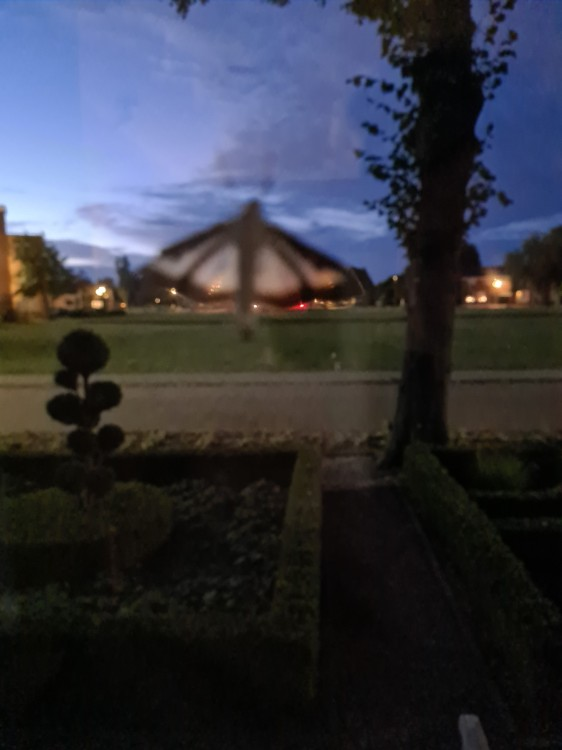

# Exploring Data Efficiency of Foundation Models for Fine-Grained Image Classification of Lepidopteran Species

This is the work for a Bachelor Thesis (B.Sc.), absolved at the explainable AI Chair (xAI) of the Otto Friedrich University Bamberg.

## Table of Contents

- [Introduction](#introduction)
- [Dataset](#dataset)
- [Results](#results)
- [Project Structure](#project-structure)
- [Requirements](#requirements)
- [License](#license)
- [Acknowledgements](#acknowledgements)

## Introduction

This project tests data efficiency in the domain of fine grained image classification. Therefore a dataset comprising 1.39 million images of butterflies and moths is split into varying label- and sample amounts, to test its impact on the performance of foundation models and classifiers traind on their extracted feature embeddings. 

As the dataset is provided by GBIF (and Observation.org), it consists of citizen science data. To tackle the challenges of strongly varying image quality, this work tries to leverage the generalization capabilities of different foundation models, specificly DINOv2-Giant and ResNet-50 pretrained on ImageNet1k_V2. 

Trained on their embeddings were a Logistic Regression and K-Nearest Neighbors Classifier. 


## Dataset

Links to the images used for feature extraction are given in the `dataset_top589_max3000_fex_statusupdate.csv` dataset. The original dataset (hosted on GBIF) can be accessed under the following [link](https://doi.org/10.15468/dl.8byj47). The images are varying strongly in quality, some example images are given below.
<p align="center">
    
    
    
</p>

## Results


Some accuracies derived using cross validation for different dataset variants and Foundation Model - Classifier combinations. Further results are given in the notebooks numbered from 07 to 10.

## Project Structure

- **data/**: Contains the dataset and processed data.
- **notebooks/**: Contains the jupyter notebooks for analysis and creation of datasets, analysis of results, and further helpful tools.
- **scripts/**: Contains the scripts for feature extraction, testing, and evaluation.
- **src/**: Contains the source code for custom dataset classes and utility functions.

## Notes for Project Setup

Since the data used for this project is not available due to its size, it would have to be retrieved again by whoever that wants to reproduce, improve or investigate this work. 

Links to the images are given as stated above, advised download speed is 2 images per second, the  `01_image_downloader.py` can be used for this purpose.
After qulaity control, the feature embeddings of the two Foundation Models can be extracted using the `05_feature_extractor.py` script. From there on tests provided in the scripts numerated from 06 to 09 can be used for experimenting.

The results are still provided in the `data` folder and are free for further investigation. Since GitHub doesn't allow files bigger than 100MB without a premium subscription, some bigger files are listed [here](https://mega.nz/#P!AgDk7TWIGkvliYQXwY7xKz-ZwIB-UzxaC0mo2QziQqpmzysVFUroFqZh--bnt2pA8ILNE-Inm_9a62v5wCDKHs_hBDRfp10Mh9KYG2AW3OV_02t240P4nA). (Password: 'Lepidoptera')

## Requirements

- Python 3.8.10
- PyTorch
- torchvision
- scikit-learn
- pandas
- numpy
- matplotlib
- umap-learn

Install the required packages using pip:

```bash
pip install -r requirements.txt
```
## License

This project is licensed under the MIT License.

## Acknowledgements

Special thanks goes to Jonas Alle (M.Sc.) who supervised this project and contributed greatly with valuable explainations, advice, experience and good humor! Furthermore I want to thank Prof. Dr. Ledig for being my first supervisor and letting me do the thesis at his chair.
